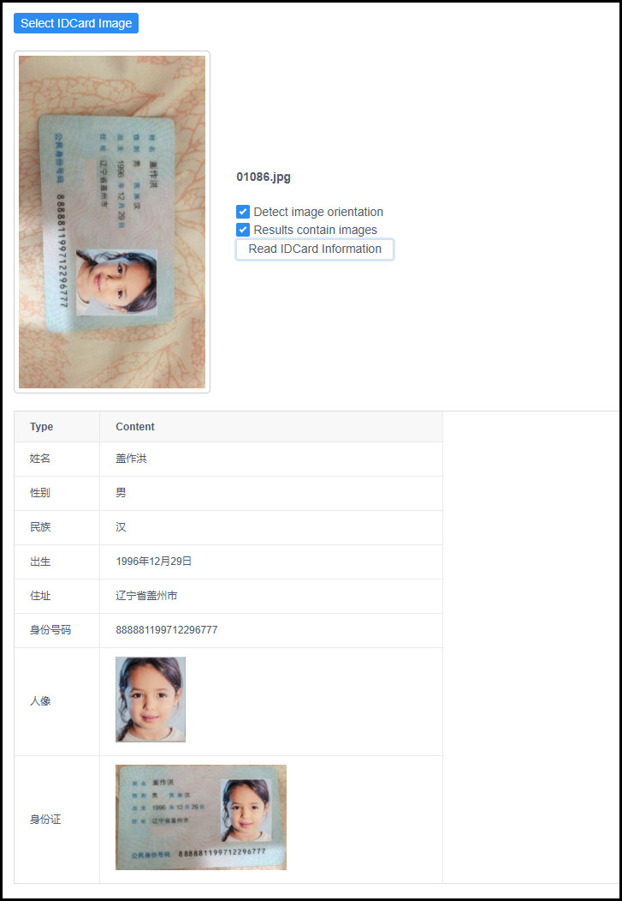

# Description
```
用于对身份证照片的数据进行提取。 
可提取的信息包括：名、性、民族、照片、号码等内容。 
```

# Build
* 构建和运行时相关依赖注意安装和下载. 
* 请参考 Dockerfile 进行构建和运行.
* 然后 http://127.0.0.1:5000  可以进行测试和验证. 


# Technology-stack
- Python 
- Yolov5
- PaddleOCR 
- pytorch
- dlib
- Flask
- opencv
- etc...


# Example
- Detect image orientation.  开启图处角度检测.
- Result contain images. api 响应中包含识别图片
[]


# Issue
- 图片需要尽量清晰、倾斜角度不能过大， 否则可能无法识别或者识别的信息有误
- 少数民族地区的身份证上会有少数民族的文件，对识别可能会产生误导
- Detect image orientation.  使用两眼连线判断图片旋转角度， 但是不稳定， 待优化. 
- Docker image 有点大， 网络受限没有条件上传至 dockerhub.

